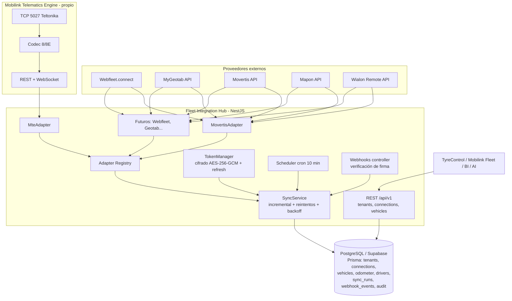

# Informe técnico — Integración con plataformas de gestión de flotas

**Proyecto:** SaaS de gestión integral de neumáticos (TyreControl / Mobilink) · **Fecha:** julio 2026
**Objetivo:** obtener automáticamente vehículos, matrículas, kilometraje, horas de motor, conductores, estado, posición GPS, eventos de mantenimiento y datos CAN/FMS desde las principales plataformas europeas, sin depender de un único proveedor.

> Metodología: investigación sobre portales oficiales de desarrolladores y fuentes públicas (julio 2026). Varios portales bloquean el acceso automatizado (403), por lo que algunos datos se verificaron vía índices de búsqueda, SDKs públicos y fuentes secundarias. "n/d" = no disponible públicamente, nunca inventado.

---

## 1. Fichas por plataforma

### 1.1 Webfleet (Bridgestone Mobility Solutions)

| Campo | Detalle |
|---|---|
| País / tamaño | Países Bajos (Ámsterdam). >2 M vehículos en +65 países; >1,2 M suscripciones EMEA; >50.000 clientes; >1.000 empleados |
| Sectores | Transporte HGV/LCV, servicios, construcción, autobuses, EV |
| Relevancia | **Nº 1 europeo** (Frost & Sullivan 2025). Fuerte presencia comercial en España |
| API | **WEBFLEET.connect** (HTTPS, salida CSV/JSON/SOAP) + LINK.connect (accesorios BT, incl. **TPMS**) + OEM.connect + OAuth APIs nuevas |
| Autenticación | Clásica: account+username+password+apikey (key bajo solicitud). Nuevas APIs: OAuth 2.0 (JWT) y Basic |
| Docs | Referencia PDF versionada 1.74.0 (media.webfleet.com) + portal de recursos para desarrolladores |
| Datos lectura | Posiciones, **odómetro**, **horas de motor** (`engine_operation_time`), CAN/FMS (combustible), conductores, eventos, pedidos, tacógrafo |
| Datos escritura | Pedidos, conductores, vehículos, mensajes, áreas |
| Webhooks | No HTTP clásicos; **colas de mensajes** + polling |
| SDKs | Sin SDK oficial; wrappers Python/JS comunitarios |
| Limitaciones | Rate limit base **10 req/min por cuenta** (ampliable); API key la solicita cada cliente titular |
| Teltonika | ❌ (hardware cerrado LINK/OEM) · **CAN Bus** ✅ · **FMS/J1939** ✅ (LINK 710/740) |
| Mantenimiento | Programación de tareas de servicio; TPMS de terceros vía LINK.connect — muy relevante para neumáticos |

### 1.2 Geotab

| Campo | Detalle |
|---|---|
| País / tamaño | Canadá (Oakville). **~5 M vehículos**, >1 M suscripciones EMEA, ~3.000 empleados, >681 M$ (2024). Compró el negocio europeo de Verizon Connect (2025) |
| Relevancia | Líder EMEA; opera en España con canal propio |
| API | **MyGeotab API** (JSON-RPC sobre HTTPS) + MyAdmin API. SDK gratuito |
| Autenticación | `Authenticate` (user+pass+database) → sessionId (caduca a 14 días; máx. 100 sesiones) |
| Docs | developers.geotab.com + geotab.github.io/sdk |
| Datos lectura | `StatusData` con **DiagnosticOdometerId** (ECM) y ajustado, **DiagnosticEngineHoursId**, `LogRecord` (GPS), conductores (`DriverChange`), VIN/matrícula en `Device`, **miles de diagnósticos CAN incl. TPMS si el vehículo lo emite**, DTCs (`FaultData`), mantenimiento |
| Datos escritura | Add/Set/Remove sobre la mayoría de entidades (según roles) |
| Webhooks | No nativos; **`GetFeed` incremental** (fromVersion) + notificaciones web por reglas |
| SDKs | .NET, JS/Node, Java, Python oficiales |
| Limitaciones | 60 llamadas/min por entidad de feed; una `database` por cliente (multi-tenant real) |
| Teltonika | ✅ **partner oficial Marketplace** (custom telematics devices, cuota/dispositivo) · CAN ✅ · FMS/J1939 ✅ |

### 1.3 Samsara

| Campo | Detalle |
|---|---|
| País / tamaño | EE. UU. ~5.400 empleados, ~1.620 M$ (FY2026). Europa creciente (Londres/Ámsterdam); sin oficina en España |
| API | **Samsara API** (REST v2, api.samsara.com) — la mejor documentada del sector |
| Autenticación | API Token o **OAuth 2.0** (para apps de Marketplace multi-cliente) |
| Docs | developers.samsara.com |
| Datos lectura | `/fleet/vehicles/stats` con **obdOdometerMeters**, horas motor, GPS, combustible, DTCs, conductores, VIN/matrícula, DVIR (inspecciones) |
| Datos escritura | Vehículos (PATCH), conductores, resolver defectos DVIR, webhooks |
| Webhooks | ✅ configurables por API + endpoints `feed` incrementales |
| SDKs | Python, TypeScript, Java, .NET oficiales |
| Limitaciones | 150 req/s por token; endpoints ligados a licencia del plan del cliente |
| Teltonika | ❌ hardware cerrado (gateways propios + OEM cloud-to-cloud Stellantis) · CAN ✅ · J1939 ✅ (propio) |
| Nota | Categoría "tire monitoring" ya existe en su Marketplace |

### 1.4 Movertis (España)

| Campo | Detalle |
|---|---|
| País / tamaño | España (Girona). +1.000 clientes europeos; partner de Telefónica Tech |
| Relevancia | Actor español mediano, fuerte en pymes de transporte; +40 integraciones ERP/TMS |
| API | **Movertis API** (REST v1) — developers.movertis.com, docs en español |
| Autenticación | Bearer token estático **emitido por soporte** (no autoservicio, no OAuth) |
| Datos | Vehículos, posiciones, conductores, rutas, km/actividad, consumo; odómetro/horas motor por API: confirmar con soporte |
| Webhooks / SDKs | n/d / ninguno |
| Teltonika | Hardware propio (probable base Teltonika, sin confirmación) · CAN/tacógrafo ✅ en pesados |
| Valoración | Integración media-alta: API simple en español, trato cercano; fricción solo en el alta del token |

### 1.5 Verizon Connect (Reveal)

| Campo | Detalle |
|---|---|
| País / tamaño | EE. UU. (ex-Fleetmatics, Dublín). ~826k suscriptores al adquirirse; actual n/d. **Ojo: el negocio europeo fue vendido a Geotab (2025)** — España no estaba en la lista de países transferidos |
| API | **Reveal APIs / FIM** (REST): Vehicle, Vehicle Update, GPS History, Driver, Segment Data. Portal EU: fim.eu.fleetmatics.com |
| Autenticación | Basic → token **Atmosphere** (expira a los 20 min, renovable) |
| Datos | Posiciones (actual+histórico), **odómetro** (lectura y actualización), **horas motor**, conductores, matrícula/VIN, alertas |
| Webhooks | ✅ GPS Push Service (tipo SNS) + alert webhooks (alta vía soporte) |
| SDKs | Ninguno oficial |
| Limitaciones | API restringida al tier alto del contrato; rate limits n/d; dos generaciones de API |
| Teltonika | ❌ · CAN/J1939 solo con hardware propio |

### 1.6 Michelin Connected Fleet (Masternaut)

| Campo | Detalle |
|---|---|
| País / tamaño | Francia (grupo Michelin). +700.000 vehículos en 18 países; **+10.000 vehículos en España** |
| API | **Masternaut Connect API** (REST, api.masternautconnect.com) |
| Autenticación | Usuario API + contraseña + customerId (Basic); no OAuth |
| Docs | Gated (portal de soporte; docs completas vía gestor) |
| Datos | Vehículos, posiciones, viajes, conductores, odómetro/uso, CAN/FMS en pesados; escritura: POIs, conductores |
| Webhooks / SDKs | n/d / SDK Java comunitario (con rate-limiting integrado) |
| Teltonika | ❌ hardware propio · CAN/FMS ✅ |
| ⚠️ Estratégico | Michelin es **competidor potencial directo** en gestión de neumáticos — valorar antes de compartir pipeline comercial |

### 1.7 Targa Telematics (+ Viasat)

Italia. +3,5 M activos, €125 M (2025), líder europeo según Frost & Sullivan; en España vía filiales ex-Viasat. Plataforma IoT abierta y **hardware-agnóstica** (integra OEM + aftermarket), pero **sin portal público de desarrolladores**: API solo bajo acuerdo B2B enterprise. Auth/webhooks/SDKs: n/d. Interesante solo con acuerdo comercial.

### 1.8 ABAX

Noruega. +500.000 unidades, líder nórdico; **presencia en España mínima**. **ABAX Open API**: la más moderna del grupo — **OAuth2** (client credentials / auth code + refresh), portal autoservicio developers.abax.cloud, `GET v1/trips/odometerReadings` (odómetro confirmado), equipment usage (horas). SDK comunitario TS. Hardware propio cerrado, CAN limitado. Técnicamente excelente, comercialmente irrelevante en España hoy.

### 1.9 Quartix

Reino Unido (AIM). ~300.000 vehículos; España desde ~2018 (ES+IT: ARR £4,1 M). API existe pero **sin portal público** (docs bajo solicitud); auth n/d; sin webhooks/SDKs documentados; hardware propio ligero **sin CAN/FMS**. Solo posiciones/viajes/km en flota ligera. Prioridad baja.

### 1.10 Mapon

| Campo | Detalle |
|---|---|
| País / tamaño | Letonia. >30.000 clientes, **>285.000 dispositivos**; **oficina en España** |
| API | **Mapon API** (REST, mapon.com/api) — pública y documentada |
| Autenticación | **API key** autoservicio (Settings → API keys, permisos por clave) |
| Datos | `unit/data` con flags `can`, `fuel`, `drivers`; **odómetro CAN y GPS diferenciados**, horas motor, tacógrafo, matrícula/VIN, temperaturas |
| Webhooks | n/d (reenvío de datos/alertas existe) |
| SDKs | **PHP oficial**; Ruby comunitario |
| Teltonika | ✅ **partner >10 años** — hardware-agnóstica · CAN ✅ · FMS ✅ |
| Valoración | **La integración más sencilla de todas** con datos completos |

### 1.11 AddSecure (Vehco / Groeneveld)

Suecia. Líder europeo en telemática de camión (Frost & Sullivan 2024); España vía ex-Groeneveld/Vehco. Datos de camión muy ricos (CAN/FMS, tacógrafo, horas motor) pero **API por proyecto, sin portal público** (soporta rFMS). Auth/webhooks/SDKs: n/d. Solo si un cliente ancla lo usa.

### 1.12 Gurtam — Wialon

| Campo | Detalle |
|---|---|
| País / tamaño | Lituania (Vilna). **~4 M unidades**, ~2.500 partners en 150 países; en España vía partners/TSP locales |
| API | **Wialon Remote API** + JS SDK + Apps + colección Postman oficial |
| Autenticación | Token vía login.wialon.com (flujo tipo OAuth) → sesión `eid` |
| Datos | Posiciones, **odómetro y horas motor (contadores)**, sensores CAN/FMS, combustible, conductores, tacógrafo, **intervalos de mantenimiento (CRUD)**, mensajes crudos |
| Escritura | CRUD casi total (unidades, sensores, conductores, geocercas, mantenimiento) |
| Webhooks | Long-polling `avl_evts` + **retranslators** (push de datos crudos) + notificaciones a URL externa |
| SDKs | JS oficial; Python/PHP wrappers |
| Limitaciones | Modelo de sesión peculiar; límites documentados (p.ej. 10 `avl_evts`/10 s) |
| Teltonika | ✅✅ **3.300+ dispositivos de 700 fabricantes** · CAN ✅ · FMS/J1939 ✅ |
| Valoración | Máxima capacidad técnica; acceso en España a través del TSP de cada cliente |

### 1.13 FleetGO

Países Bajos, oficina en España. +6.500 clientes. **FleetGO Developer API** (REST JSON/XML, api.fleetgo.com); auth API key+secret+usuario (vía soporte); datos de tacógrafo, posiciones, combustible; odómetro probable (n/d confirmación); sin webhooks/SDKs oficiales. Integración media, requiere contacto comercial.

### 1.14 Teletrac Navman

EE. UU. (Vontier). +700.000 activos; presencia española marginal. **TN360 API** con portal regional (docs-uk.telematics.com): API keys (Company/User/Integration) + OAuth/OIDC para SSO; Fleets/Events(Sentinel); odómetro sincronizable (probado con Fleetio). Claves vía email de integraciones. Prioridad baja en España.

### 1.15 Trimble Transportation

⚠️ **Vendió su telemática a Platform Science (feb-2025)** — ya no es proveedor telemático. Conserva TMS (TruckMate) y mantenimiento (TMT, con REST API en developer.trimble.com) que *agrega* telemática de terceros vía Fleet Hub. Descartable como fuente directa; relevante solo si un cliente usa TMT como GMAO.

### 1.16 Eurowag (WebEye / Princip / Inelo / ADS)

Chequia (LSE). +100.000 camiones en pagos; telemática WebEye (14 países) + Princip (~70.000 vehículos); en España creciente vía ADS y OBU de peajes. "API connectivity" anunciada pero **sin portal público**: docs bajo acuerdo. Datos FMS/tacógrafo ricos en plataforma. Prioridad media, vía partnership.

### 1.17 Radius Telematics (Kinesis)

Reino Unido. >600.000 unidades; **España desde 2011** (web ES). Plataforma "hardware-agnostic" pero **sin API pública documentada** — integración solo por acuerdo. Kinesis Pro lee CAN/tacógrafo. Prioridad baja salvo cliente ancla.

### 1.18 Microlise

Reino Unido (AIM, £81 M). >873.000 suscripciones; telemática de fábrica de **DAF** y partner de MAN UK. API pública parcial: **TruLinks** (filial TruTac; doble API key sobre Azure APIM) para tacógrafo/conductores/vehículos; telemetría core solo enterprise. España directa: baja; indirecta vía DAF: alta.

---

## 2. Tabla comparativa y priorización

### 2.1 Capacidades técnicas

| Plataforma | API pública | Auth | Odómetro API | Horas motor | Conductores | CAN/FMS | Webhooks/push | SDKs | Teltonika |
|---|---|---|---|---|---|---|---|---|---|
| **Mapon** | ✅ autoservicio | API key | ✅ CAN+GPS | ✅ | ✅ | ✅ | parcial | PHP | ✅ |
| **Wialon** | ✅ | Token/sesión | ✅ | ✅ | ✅ | ✅ | ✅ retranslator | JS/Py/PHP | ✅✅ |
| **Geotab** | ✅ SDK gratuito | Sesión (user/pass/db) | ✅ ECM | ✅ ECM | ✅ | ✅ | GetFeed | 4 oficiales | ✅ partner |
| **Samsara** | ✅ | Token/OAuth2 | ✅ OBD | ✅ | ✅ | ✅ | ✅ | 4 oficiales | ❌ |
| **Webfleet** | ✅ (key bajo solicitud) | apikey / OAuth2 | ✅ | ✅ | ✅ | ✅ | colas | comunitarios | ❌ |
| **ABAX** | ✅ autoservicio | OAuth2 | ✅ | equipos | trips | parcial | n/d | comunitario | ❌ |
| **Verizon Connect** | ✅ (tier alto) | Token 20 min | ✅ | ✅ | ✅ | propio | ✅ push | ❌ | ❌ |
| **Michelin CF** | gated | Basic+customerId | probable | probable | ✅ | ✅ | n/d | comunitario | ❌ |
| **Movertis** | ✅ (token soporte) | Bearer | n/d | n/d | ✅ | pesados | n/d | ❌ | probable |
| **FleetGO** | ✅ (alta comercial) | key+secret+user | n/d | tacógrafo | ✅ | propio | n/d | comunitario | n/d |
| **Teletrac Navman** | ✅ | API keys/OIDC | ✅ | probable | ✅ | propio | Events API | ❌ | n/d |
| **Microlise/TruLinks** | parcial | 2×API key | tacógrafo | n/d | ✅ | plataforma | n/d | ejemplos | n/d |
| **Eurowag/WebEye** | por acuerdo | n/d | probable | probable | ✅ | ✅ | n/d | ❌ | n/d |
| **Targa** | por acuerdo | n/d | probable | n/d | n/d | ✅ | n/d | ❌ | agnóstica |
| **AddSecure** | por proyecto | n/d | ✅ producto | ✅ producto | ✅ | ✅ rFMS | n/d | ❌ | ❌ |
| **Quartix** | bajo petición | n/d | parcial | ❌ | ✅ | ❌ | n/d | ❌ | ❌ |
| **Radius/Kinesis** | ❌ | n/d | producto | producto | producto | Pro | n/d | ❌ | n/d |
| **Trimble** | TMS/TMT solo | key/OAuth | vía terceros | vía terceros | ✅ | agrega | n/d | Maps | vía hub |

### 2.2 Puntuación para priorización comercial (España, flota industrial) — 1-5

| Plataforma | Presencia España | Calidad API | Datos km/horas | Facilidad partnership | **Total /20** |
|---|---|---|---|---|---|
| **Webfleet** | 5 | 4 | 5 | 4 | **18** |
| **Geotab** | 4 | 5 | 5 | 4 | **18** |
| **Mapon** | 4 | 5 | 5 | 4 | **18** |
| **Wialon (Gurtam)** | 4 | 4 | 5 | 4 | **17** |
| **Michelin CF** | 4 | 3 | 4 | 2 ⚠️competidor | **13** |
| **Movertis** | 5 | 3 | 2 (confirmar) | 5 | **15** |
| **Samsara** | 2 | 5 | 5 | 4 | **16** |
| **Eurowag/WebEye** | 3 | 2 | 3 | 3 | **11** |
| **Targa/Viasat** | 3 | 2 | 3 | 2 | **10** |
| **AddSecure** | 3 | 1 | 4 | 2 | **10** |
| **Verizon Connect** | 2 (vendido a Geotab en EU) | 3 | 4 | 2 | **11** |
| **FleetGO** | 3 | 3 | 2 | 3 | **11** |
| **Radius/Kinesis** | 4 | 1 | 2 | 2 | **9** |
| **Microlise** | 2 | 2 | 3 | 2 | **9** |
| **Quartix** | 3 | 1 | 2 | 2 | **8** |
| **ABAX** | 1 | 5 | 4 | 4 | **14** |
| **Teletrac Navman** | 1 | 4 | 4 | 3 | **12** |
| **Trimble** | 1 | 3 | 1 | 2 | **7** |

**Orden de integración recomendado:**
1. **MTE propio** (Teltonika FMC150/FMC650) — ya implementado, coste marginal cero, cubre flotas sin telemática contratada
2. **Movertis** — proveedor español, partnership rápido, base de clientes objetivo idéntica *(adaptador de ejemplo ya implementado)*
3. **Webfleet** — nº1 europeo, presencia máxima en España, odómetro+horas+FMS y TPMS vía LINK.connect
4. **Geotab** — líder en crecimiento EMEA (absorbió Verizon EU), API impecable, ecosistema Teltonika
5. **Mapon / Wialon** — esfuerzo mínimo (Mapon) y máximo alcance multi-hardware (Wialon: cubre a decenas de TSP españoles pequeños con una sola integración)
6. **Samsara** — API excelente; activar cuando haya demanda de clientes con su hardware
7. Bajo demanda de cliente ancla: Michelin CF (⚠️ conflicto competitivo), Eurowag, AddSecure, Targa, FleetGO, Verizon, Quartix, Radius, Microlise, Teletrac, ABAX

---

## 3. Arquitectura del sistema de integraciones (implementada)

El monorepo **`fleet-integration-hub/`** de este repositorio implementa esta arquitectura (NestJS + PostgreSQL + Prisma, patrón Adapter). El motor telemático propio (**MTE**, directorio `mte/`) se consume como un proveedor más a través de su adaptador.

### 3.1 Diagrama de componentes

### 3.2 Contrato del adaptador (interfaz real)

`packages/domain/src/provider.interface.ts` define `FleetProviderAdapter`: `authenticate`, `healthCheck`, `listVehicles`, `listOdometerReadings`, `listEngineHours`, `listDrivers`, `listPositions`, `listVehicleStatus`, `listMaintenanceEvents`, `parseWebhook?` — todas paginadas con `Page<T>` (cursor opaco) y ventana `SyncWindow {since, cursor}` para sincronización incremental. `ProviderCapabilities` declara qué soporta cada plataforma; el `BaseFleetAdapter` responde `unsupported` al resto, de modo que el hub degrada limpiamente por proveedor.

**DTOs comunes** (`dtos.ts`): `VehicleDTO` (matrícula, VIN, categoría), `OdometerReadingDTO` (**siempre en metros**, con `source: can|gps|declared`), `EngineHoursReadingDTO`, `DriverDTO`, `PositionDTO`, `VehicleStatusDTO` (bloque CAN), `MaintenanceEventDTO`. La distinción CAN/GPS del odómetro es crítica para el coste por kilómetro de neumáticos.

### 3.3 Multi-tenant, seguridad y auditoría

- **Tenant → ProviderConnection (N)**: cada empresa cliente conecta sus propias credenciales por proveedor; unicidad `(tenant, provider, label)` permite múltiples cuentas del mismo proveedor.
- Credenciales **cifradas en reposo (AES-256-GCM)** con clave derivada de `FIH_ENCRYPTION_KEY`; nunca se exponen por API.
- **TokenManager**: renueva tokens con margen de 5 min delegando en `adapter.authenticate()` (cada adaptador implementa su flujo: OAuth2 refresh en ABAX/Samsara, re-login de sesión en Geotab/Wialon, token Atmosphere de 20 min en Verizon). Fallo de auth ⇒ conexión a `auth_error` sin reintentos, visible en panel.
- **Auditoría**: `SyncRun` por cada pasada (recurso, elementos, error), `WebhookEvent` persistido crudo, `AuditLog` para acciones administrativas.
- Aislamiento de datos por `tenantId` en todas las tablas canónicas (índices compuestos).

### 3.4 Sincronización, errores y reintentos

- **Incremental**: estado `(since, cursor)` por conexión y recurso en `syncState`; paginación hasta agotar cursor; tras completar, `since = now`.
- **Idempotencia**: upserts con claves naturales (`tenant+provider+externalId`, `vehicle+ts`) — los reenvíos y solapes no duplican.
- **Errores tipados** (`ProviderError`): `auth` (no reintentar), `rate_limit` (respeta `Retry-After`), `transient` (backoff exponencial 2s→16s, máx. 4), `permanent` (registrar y saltar), `unsupported`.
- **Webhooks**: endpoint genérico `POST /webhooks/:connectionId`; el adaptador verifica la firma (secreto por conexión) y normaliza; el hub persiste y dispara una sincronización dirigida. Para proveedores sin webhooks (Webfleet, Geotab) el scheduler hace polling incremental (GetFeed / colas).
- **Escalabilidad**: servicios stateless; el scheduler es sustituible por una cola (BullMQ/pg-boss) con un job por conexión para escalar horizontalmente; los adaptadores no guardan estado. Particionar `fih_odometer_readings`/`mte_positions` por rango temporal cuando crezcan.

### 3.5 Flujo de una sincronización

1. Cron (10 min) o webhook → `SyncService.syncConnection(id)`
2. TokenManager descifra credenciales y renueva token si caduca en <5 min
3. Por cada recurso soportado: bucle de páginas `adapter.listX(credentials, {since, cursor})`
4. Normalización ya hecha por el adaptador → upserts idempotentes en PostgreSQL
5. Actualización de `syncState` tras cada página (reanudable ante caída)
6. `SyncRun` cerrado con métricas; TyreControl consume `/api/v1/vehicles` y `/api/v1/vehicles/:id/odometer`

---

## 4. Roadmap de desarrollo

| Fase | Alcance | Duración orient. |
|---|---|---|
| **F0 — Base (hecha)** | Monorepo FIH: dominio, adaptadores (Movertis ejemplo + MTE), sync incremental, tokens cifrados, webhooks, Prisma multi-tenant, API REST. MTE operativo (Teltonika TCP, Codec 8/8E) | ✅ |
| **F1 — Producción MTE + Movertis** | Migraciones en Supabase, despliegue (VPS/Render), validar contrato real Movertis con su soporte (token, endpoints exactos, odómetro), panel de conexiones en Mobilink | 2-3 semanas |
| **F2 — Webfleet** | Alta como integration partner .connect, adaptador WEBFLEET.connect (colas de mensajes, rate limit 10/min), mapeo odómetro/horas/FMS, TPMS vía LINK.connect si aplica | 3-4 semanas |
| **F3 — Geotab** | Adaptador MyGeotab (sesión por database, GetFeed incremental para StatusData/LogRecord/DriverChange), alta en Marketplace | 3-4 semanas |
| **F4 — Mapon + Wialon** | Mapon (API key, `unit/data` con CAN): ~1 semana. Wialon (token+sesión, contadores, retranslator opcional): 2-3 semanas. Con Wialon se cubren de golpe muchos TSP españoles pequeños | 3-4 semanas |
| **F5 — Samsara + oportunistas** | Samsara OAuth2 + Marketplace (categoría tire monitoring); ABAX si surge cliente nórdico; evaluación comercial Michelin CF/Eurowag | 3 semanas |
| **F6 — Hardening** | Cola distribuida (BullMQ), métricas (Prometheus), particionado de tablas de lecturas, panel de salud de conexiones, alertas de conexiones caídas, SLA de frescura de odómetro | continuo |

**Criterio transversal:** cada nueva integración = 1 carpeta `packages/adapters/src/<proveedor>/` (client + mapper + adapter) + registro en `registry.ts` + fixtures de test. Nada más cambia.

---

## 5. Riesgos y decisiones clave

1. **Michelin CF es competidor potencial** en neumáticos: integrar solo con acuerdo claro de datos.
2. **Verizon Connect Europa ahora es Geotab**: no invertir en el adaptador Reveal para clientes europeos; la apuesta Geotab lo cubre.
3. **Trimble ya no es telemática** (vendida a Platform Science): descartada.
4. Varias plataformas exigen que **el cliente final** solicite la API key (Webfleet, Quartix, FleetGO): diseñar el onboarding del panel para guiar al cliente en ese trámite.
5. El **MTE propio** es el plan B universal: cualquier flota sin plataforma (o con una plataforma cerrada) puede equiparse con Teltonika FMC150/650 y entrar por el puerto TCP 5027 con datos CAN/FMS completos.
